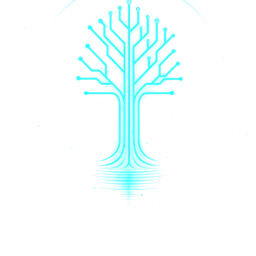

<div align="center">



# OASIS VISION

### Global Intelligence &amp; Reconnaissance · by OASIS AI

**A local-first situational awareness console. Live aircraft, satellites, maritime traffic,
27,000+ cameras, seismic and wildfire activity, severe weather, space weather, cyber threats,
conflict mapping and markets — on one GPU-rendered globe, with a reconnaissance toolkit attached.**

Runs on your machine. No account, no telemetry, and no API key required to start.

</div>

---

## What it is

OASIS VISION is a desktop application: a standalone Next.js server plus a chromeless browser
window. Every layer is rendered through WebGL via MapLibre GL, so the map holds tens of thousands
of entities without dropping frames. Each live feed is normalised by a route under `/api`, which
is where upstream differences in format, rate limit and CORS policy get absorbed.

Nothing is deployed. The data stays on the machine that fetched it.

---

## Coverage

Measured against the running application, not estimated.

| Domain | What you get | Keyless |
|---|---|:---:|
| **Aviation** | Live commercial, private and military aircraft | ✅ |
| **Cameras** | 27,000+ across 43 sources — incl. **2,148 genuinely continuous HLS streams** in California | ✅ |
| **Seismic** | USGS live feed, M2.5+ | ✅ |
| **Wildfire** | NASA FIRMS active hotspots | ✅ |
| **Weather** | NASA EONET severe events, radar | ✅ |
| **Space** | Satellite tracking, NOAA solar weather | ✅ |
| **Maritime** | Global ports and chokepoints | ✅ |
| **Markets** | Live indices, crypto, commodities | ✅ |
| **Cyber** | CVE feeds, live malware telemetry, threat maps | ✅ |
| **Conflict** | Active zones, GDACS events, frontlines | ✅ |
| **News** | 25+ 24/7 broadcast streams, GDELT | ✅ |
| **RECON** | DNS · WHOIS · certs · IP intel · breach exposure · OFAC sanctions · chain forensics | ✅ |

**~50 of 69 API routes are live and keyless.** Optional keys raise rate limits; none are needed
to run.

### Camera coverage, honestly

Roughly 14% of the world's public cameras serve continuous video. The rest publish periodic stills
or short clips — that is what the operators broadcast, not a limitation here. The interface says
which is which: `LIVE FEED` and `LIVE MJPEG` mean continuous, `RECENT CLIP` means a finite clip
being re-fetched, `SNAPSHOT` means a still on a timer. A stream that dies falls back to the
camera's own still rather than to a spinner.

No Canadian agency publishes continuous video — verified against Ontario 511, DriveBC and
Ville de Montréal. Quebec's short clips are the national ceiling.

---

## Install

```bash
git clone https://github.com/CC90210/oasis-vision.git
cd oasis-vision
npm install
npm run build
node launcher/sync-standalone.js
```

Node 20+ (developed on 24).

**Then make it a real app:**

| | Command | Result |
|---|---|---|
| **macOS** | `chmod +x launcher/*.sh && ./launcher/install-macos.sh` | `~/Applications/OASIS VISION.app` — Launchpad, Spotlight, Dock icon |
| **Windows** | `powershell -ExecutionPolicy Bypass -File launcher\install-shortcuts.ps1` | Desktop + Start Menu shortcut |

---

## Run

| Task | macOS / Linux | Windows |
|---|---|---|
| Start | `launcher/oasis-vision.sh` | `launcher\OASIS-VISION.cmd` |
| Phone / LAN | `launcher/oasis-vision.sh --lan` | `launcher\OASIS-VISION-mobile.cmd` |
| Stop | `launcher/oasis-vision.sh --stop` | `launcher\stop.cmd` |
| Rebuild | `launcher/rebuild.sh` | `launcher\rebuild.cmd` |

Serves on **port 3177**, bound to loopback. Port 3000 is avoided deliberately — it collides with
common dev servers.

> **Stop the server before rebuilding.** It executes out of `.next/standalone`; a build that
> replaces that directory while it runs fails on Windows and silently serves stale code on macOS.
> The `rebuild` scripts handle this. A bare `npm run build` does not.

### On a phone

`--lan` prints the URL. If Tailscale is running it recommends that instead, and it should be
taken: Safari withholds geolocation on an insecure origin, so plain HTTP can never be the answer
for a mapping tool. `tailscale serve --bg 3177` fronts it with a real certificate.

---

## Keyboard

`F` flights · `E` earthquakes · `S` satellites · `D` day/night · `R` reset view · `?` all
shortcuts · `Esc` close panel

---

## Development

```bash
npx tsc --noEmit      # must be clean
npx vitest run        # 575 tests
npm run build         # must exit 0
```

`npm run lint` exhausts an 8 GB heap on this codebase — a known upstream problem. Use `tsc` as the
gate.

Conventions, the four rules that keep this codebase honest, and the current known gaps are in
[CLAUDE.md](CLAUDE.md).

---

## Attribution

OASIS VISION began as a fork of [simplifaisoul/osiris](https://github.com/simplifaisoul/osiris)
(MIT) and has diverged substantially. The original copyright notice is retained in
[LICENSE](LICENSE) as the MIT licence requires.

Data is supplied by the public feeds each layer names in the interface — USGS, NASA FIRMS and
EONET, NOAA SWPC, OpenSky, GDELT and GDACS, OpenSanctions, and the transport authorities behind
the camera layers: Caltrans, Ontario 511, Quebec 511, DriveBC, TfL, ODOT, MDOT, INDOT, NDOT,
UDOT, LADOTD, ASFINAG, DGT, Fintraffic, THB, HK Transport Department, NZTA and others.

Basemaps © CARTO and OpenFreeMap, © OpenStreetMap contributors. Satellite imagery © Esri.

<div align="center">

**OASIS AI**

</div>
